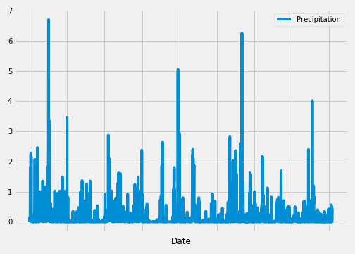

# SQLAlchemy-Climate

Step 1 - Climate Analysis and Exploration

Using Python, SQLAlchemy ORM queries and Pandas to do basic climate analysis and data exploration of climate database. Plot the analysis using Matplotlib.

Step 2 - Climate App

After completing initial analysis, design a Flask API to create routes based on the queries developed.

Precipitation Analysis

